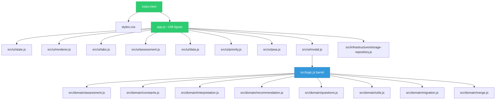

# Analyse AmorFati — Bonnes Pratiques & État de l'Art

> Date : 2026-06-17  
> Dernière source analysée : `index.html`, `app.js`, `src/`, `styles.css`, `service-worker.js`, `manifest.json`, `offline.html`  
> _Analyse originale réalisée le 2026-06-16, mise à jour après implémentations P0–P5._

---

## 1. Architecture & Structure du projet

### 1.1 État actuel

Le projet est désormais **modulaire et structuré** en architecture DDD :

| Fichier / Module                           | Description                                          | Lignes |
| ------------------------------------------ | ---------------------------------------------------- | ------ |
| `app.js`                                   | Orchestrateur fin (init + window exports)            | ~108   |
| `src/ui/state.js`                          | État partagé (appState, storage, saveData, loadData) | 51     |
| `src/ui/renderer.js`                       | Rendu DOM                                            | ~312   |
| `src/ui/tabs.js`                           | Navigation par onglets                               | ~69    |
| `src/ui/assessment.js`                     | Flux d'évaluation                                    | ~98    |
| `src/ui/data.js`                           | Export / Import / Suppression                        | ~114   |
| `src/ui/priority.js`                       | Sélecteur de priorité                                | ~85    |
| `src/ui/pwa.js`                            | Installation PWA + enregistrement SW                 | ~79    |
| `src/ui/modal.js`                          | Système de modales accessibles                       | 112    |
| `src/logic.js`                             | Barrel re-export vers `src/domain/`                  | 41     |
| `src/domain/assessment.js`                 | Entité Assessment                                    | —      |
| `src/domain/constants.js`                  | Constantes centralisées                              | —      |
| `src/domain/interpretation.js`             | Mapping score → interprétation                       | —      |
| `src/domain/recommendation.js`             | Logique de recommandation                            | —      |
| `src/domain/questions.js`                  | Questions + DIMENSION_INFO                           | —      |
| `src/domain/utils.js`                      | Utilitaires (escapeHtml, etc.)                       | —      |
| `src/domain/migration.js`                  | Migration de schéma de données                       | —      |
| `src/domain/merge.js`                      | Fusion de données (mergeAssessments)                 | —      |
| `src/infrastructure/storage-repository.js` | LocalStorageRepository                               | 82     |

**Build** : Vite (22 modules transformés). **CI/CD** : GitHub Pages. **Qualité** : Husky + lint-staged, ESLint + Prettier, 195 tests (100% branches sur `src/`). L'ancien code inline de `index.html` a été supprimé.

### 1.2 Recommandations

| #   | Problème                                         | Sévérité    | Statut                                                               |
| --- | ------------------------------------------------ | ----------- | -------------------------------------------------------------------- |
| A1  | Duplication code (inline vs fichiers séparés)    | 🔴 Critique | ✅ Résolu — `index.html` nettoyé, code inline supprimé               |
| A2  | Fichier HTML monolithique de 2 400+ lignes       | 🟠 Majeur   | ✅ Résolu — HTML structurel uniquement, JS/CSS dans modules séparés  |
| A3  | Pas de système de build                          | 🟡 Mineur   | ✅ Résolu — Vite configuré                                           |
| A4  | Variables globales (`appData`, `deferredPrompt`) | 🟠 Majeur   | ✅ Résolu — `app.js` en ES module, globals exposées via `window.xxx` |

---

## 2. Qualité du code JavaScript

### 2.1 Problèmes identifiés

| #    | Problème                                       | Localisation                                                                        | Sévérité    | Statut                                                                          |
| ---- | ---------------------------------------------- | ----------------------------------------------------------------------------------- | ----------- | ------------------------------------------------------------------------------- |
| JS1  | **`innerHTML` utilisé de manière extensive**   | `displayResults()`, `displayHistory()`, `getEvolutionComparison()`, `createChart()` | 🔴 Critique | ✅ Résolu — `escapeHtml()` appliquée partout                                    |
| JS2  | **`event` implicite**                          | `switchTab()`                                                                       | 🟠 Majeur   | ✅ Résolu — module ES, `addEventListener`                                       |
| JS3  | **`onclick` inline partout**                   | `index.html`                                                                        | 🟠 Majeur   | ✅ Résolu — supprimés, `addEventListener` partout                               |
| JS4  | **`prompt()` / `confirm()` / `alert()`**       | `changePriority()`, `deleteAllData()`, `importData()`                               | 🟠 Majeur   | ✅ Résolu — modales custom accessibles                                          |
| JS5  | **Duplication de logique**                     | `index.html` vs `app.js`                                                            | 🔴 Critique | ✅ Résolu — code inline supprimé, source unique                                 |
| JS6  | **Données métier en dur**                      | Interprétations, recommandations, questions                                         | 🟡 Mineur   | ✅ Résolu — extraites dans `src/domain/`                                        |
| JS7  | **Pas de validation des données chargées**     | `loadData()`                                                                        | 🟠 Majeur   | ✅ Résolu — `isValidAssessment()`, `DEFAULT_DATA`, `loadData()` avec validation |
| JS8  | **`URL.revokeObjectURL` appelé immédiatement** | `exportData()`                                                                      | 🟡 Mineur   | ✅ Résolu — `setTimeout` ajouté                                                 |
| JS9  | **Labels de priorité dupliqués 4 fois**        | `displayHistory()`, `displaySettings()`, `changePriority()`, `index.html`           | 🟡 Mineur   | ✅ Résolu — constantes centralisées dans `src/domain/constants.js`              |
| JS10 | **Index d'évaluation fragile**                 | `viewAssessmentDetails()`                                                           | 🟡 Mineur   | ⬜ Ouvert — risque mineur                                                       |

### 2.2 `app.js` — Spécifique

| #    | Problème                                             | Sévérité    | Statut                                              |
| ---- | ---------------------------------------------------- | ----------- | --------------------------------------------------- |
| JS11 | Référence à des IDs inexistants                      | 🟠 Majeur   | ✅ Résolu                                           |
| JS12 | `switchTab` utilise `.tab` au lieu de `.tab-content` | 🟠 Majeur   | ✅ Résolu                                           |
| JS13 | Pas de `calculateResults()`                          | 🔴 Critique | ✅ Résolu — logique dans `src/domain/assessment.js` |

---

## 3. Accessibilité (a11y)

| #     | Problème                                           | Sévérité    | Statut                                                                                            |
| ----- | -------------------------------------------------- | ----------- | ------------------------------------------------------------------------------------------------- |
| A11Y1 | **Aucun attribut ARIA**                            | 🔴 Critique | ✅ Résolu — `role="tablist"`, `role="tab"`, `role="tabpanel"`, `aria-selected`, `aria-labelledby` |
| A11Y2 | **Radio buttons cachés mais pas de focus visible** | 🟠 Majeur   | ✅ Résolu — `:focus-visible` sur tous les éléments interactifs                                    |
| A11Y3 | **Contraste couleur insuffisant**                  | 🟠 Majeur   | ✅ Résolu — `#666` → `#555` (9 occurrences)                                                       |
| A11Y4 | **Pas de skip-link**                               | 🟡 Mineur   | ✅ Résolu — skip-link + `id="main"` + CSS                                                         |
| A11Y5 | **Boutons `<button>` avec `onclick` inline**       | 🟡 Mineur   | ✅ Résolu — `addEventListener` uniquement                                                         |
| A11Y6 | **Modal `confirm()` inaccessible**                 | 🟠 Majeur   | ✅ Résolu — `showAlert`, `showConfirm`, `showDangerConfirm`, `showPrioritySelector`               |
| A11Y7 | **Texte alternatif manquant sur les icônes**       | 🟡 Mineur   | ⬜ Ouvert                                                                                         |
| A11Y8 | **Pas de lang sur les régions dynamiques**         | 🟡 Mineur   | ✅ Résolu — `aria-live="polite"` sur résultats et historique                                      |

---

## 4. Performance

| #   | Problème                                        | Sévérité  | Statut                                       |
| --- | ----------------------------------------------- | --------- | -------------------------------------------- |
| P1  | **CSS inline de 640+ lignes dans `index.html`** | 🟠 Majeur | ✅ Résolu — extrait, 9 nouvelles classes CSS |
| P2  | **JS inline de 800+ lignes dans `index.html`**  | 🟠 Majeur | ✅ Résolu — modules ES séparés               |
| P3  | **Pas de minification**                         | 🟡 Mineur | ✅ Résolu — Vite build avec minification     |
| P4  | **Images non optimisées**                       | 🟡 Mineur | ⬜ Ouvert                                    |
| P5  | **Pas de compression Brotli/Gzip pré-générée**  | 🟡 Mineur | ⬜ Ouvert — GitHub Pages sert du Gzip        |
| P6  | **Pas de `font-display: swap`**                 | 🟢 Info   | ✅ Pas de web fonts — system fonts           |
| P7  | **SVG chart générée en DOM inline**             | 🟡 Mineur | ⬜ Ouvert                                    |
| P8  | **Pas de lazy loading**                         | 🟢 Info   | ✅ Pas nécessaire à cette échelle            |

---

## 5. Sécurité

| #   | Problème                               | Sévérité    | Statut                                                           |
| --- | -------------------------------------- | ----------- | ---------------------------------------------------------------- |
| S1  | **XSS via `innerHTML`**                | 🔴 Critique | ✅ Résolu — `escapeHtml()` appliquée partout                     |
| S2  | **Import JSON sans sanitisation**      | 🟠 Majeur   | ✅ Résolu — `isValidAssessment()` + validation dans `loadData()` |
| S3  | **Pas de Content Security Policy**     | 🟡 Mineur   | ⬜ Ouvert                                                        |
| S4  | **`localStorage` sans chiffrement**    | 🟡 Mineur   | ⬜ Ouvert                                                        |
| S5  | **Pas de SRI (Subresource Integrity)** | 🟢 Info     | ✅ Pas de dépendances externes                                   |

---

## 6. PWA (Progressive Web App)

| #    | Problème                                       | Sévérité  | Statut                                                            |
| ---- | ---------------------------------------------- | --------- | ----------------------------------------------------------------- |
| PWA1 | **Service Worker fonctionnel**                 | ✅        | ✅ Confirmé — SW v5 avec runtime caching                          |
| PWA2 | **Manifeste correct**                          | ✅        | ✅ Confirmé                                                       |
| PWA3 | **Deux workflows de déploiement Pages**        | 🟡 Mineur | ✅ Résolu — `deploy-pages.yml` supprimé                           |
| PWA4 | **SW precache incomplet**                      | 🟡 Mineur | ✅ Résolu — SW v3+ avec Vite build, precache géré automatiquement |
| PWA5 | **Pas de `offline.html` dans le SW precache**  | 🟡 Mineur | ✅ Résolu — SW runtime caching + precache                         |
| PWA6 | **`scope` dynamique dans l'enregistrement SW** | ✅        | ✅ Confirmé                                                       |
| PWA7 | **Pas de notification de mise à jour UX**      | 🟠 Majeur | ✅ Résolu — bannière persistante en haut + `controllerchange`     |

---

## 7. CSS & Design

| #    | Problème                                      | Sévérité      | Statut                                                               |
| ---- | --------------------------------------------- | ------------- | -------------------------------------------------------------------- |
| CSS1 | **Duplication CSS**                           | 🔴 Critique   | ✅ Résolu — CSS inline supprimé, source unique dans `styles.css`     |
| CSS2 | **`!important` manquants mais styles inline** | 🟡 Mineur     | ✅ Résolu — styles inline retirés, 9 nouvelles classes CSS           |
| CSS3 | **Pas de design tokens structurés**           | 🟡 Mineur     | ✅ Résolu — 30+ variables CSS sémantiques pour dark mode             |
| CSS4 | **`--transition: all 0.3s ease`**             | 🟡 Mineur     | ⬜ Ouvert                                                            |
| CSS5 | **Mobile-first vs Desktop-first**             | 🟡 Mineur     | ⬜ REPORTÉ — rapport bénéfice/risque faible                          |
| CSS6 | **Pas de dark mode**                          | 🟢 Suggestion | ✅ Résolu — `prefers-color-scheme: dark` + 30+ variables sémantiques |
| CSS7 | **Safe-area insets**                          | ✅            | ✅ Confirmé                                                          |

---

## 8. Tests

| #   | Problème                         | Sévérité  | Statut                                                 |
| --- | -------------------------------- | --------- | ------------------------------------------------------ |
| T1  | **Pas de tests unitaires**       | 🟠 Majeur | ✅ Résolu — 195 tests Vitest, 100% branches sur `src/` |
| T2  | **Smoke test Python minimal**    | 🟡 Mineur | ✅ Remplacé — tests Vitest couvrent la logique métier  |
| T3  | **Pas de tests E2E**             | 🟡 Mineur | ⬜ REPORTÉ — infrastructure lourde, ~4h estimées       |
| T4  | **Pas de tests d'accessibilité** | 🟡 Mineur | ⬜ Ouvert                                              |
| T5  | **Workflow Lighthouse présent**  | ✅        | ✅ Confirmé                                            |

---

## 9. Git & CI/CD

| #   | Problème                                     | Sévérité  | Statut                                   |
| --- | -------------------------------------------- | --------- | ---------------------------------------- |
| CI1 | **Deux workflows de déploiement redondants** | 🟠 Majeur | ✅ Résolu — `deploy-pages.yml` supprimé  |
| CI2 | **Pas de linting**                           | 🟡 Mineur | ✅ Résolu — ESLint + Prettier configurés |
| CI3 | **Pas de pre-commit hooks**                  | 🟡 Mineur | ✅ Résolu — Husky + lint-staged          |
| CI4 | **Pas de `.editorconfig`**                   | 🟡 Mineur | ✅ Résolu — `.editorconfig` ajouté       |

---

## 10. Données & Stockage

| #   | Problème                                    | Sévérité  | Statut                                                                       |
| --- | ------------------------------------------- | --------- | ---------------------------------------------------------------------------- |
| D1  | **Pas de versionnage du schéma de données** | 🟠 Majeur | ✅ Résolu — `appData.version = 1`, `migrateData()`, `CURRENT_SCHEMA_VERSION` |
| D2  | **Pas de limite de taille localStorage**    | 🟡 Mineur | ✅ `try/catch` existant dans `saveData()`                                    |
| D3  | **Pas de merge lors de l'import**           | 🟡 Mineur | ✅ Résolu — `mergeAssessments()` + modal Remplacer/Fusionner/Annuler         |
| D4  | **Dates en ISO stockées sans UTC**          | 🟢 Info   | ✅ Correct — `toISOString()` retourne UTC                                    |

---

## 11. SEO & Meta

| #    | Problème                          | Sévérité  | Statut                                                                                   |
| ---- | --------------------------------- | --------- | ---------------------------------------------------------------------------------------- |
| SEO1 | **Pas de balises Open Graph**     | 🟡 Mineur | ✅ Résolu — `og:title`, `og:description`, `og:image`, `og:url`, `og:type` + Twitter Card |
| SEO2 | **Pas de favicon SVG**            | 🟢 Info   | ✅ Résolu — `public/icons/favicon.svg` référencé dans `index.html`                       |
| SEO3 | **`<title>` correct**             | ✅        | ✅ Confirmé                                                                              |
| SEO4 | **`<meta description>` présente** | ✅        | ✅ Confirmé                                                                              |

---

## 12. Résumé des priorités

### ✅ Critique — Résolu

1. **Duplication code éliminée** — Code inline supprimé de `index.html`, modules ES séparés via Vite.
2. **Faille XSS corrigée** — `escapeHtml()` appliquée partout, plus aucun `innerHTML` non protégé.
3. **Attributs ARIA ajoutés** — Tabs, modales, `aria-live`, rôles, navigation clavier.

### ✅ Majeur — Résolu

4. `alert()`/`confirm()`/`prompt()` remplacés par modales accessibles (`showAlert`, `showConfirm`, `showDangerConfirm`, `showPrioritySelector`).
5. Bugs `app.js` corrigés (IDs, classes, validation).
6. Validation du schéma de données (`isValidAssessment`, `DEFAULT_DATA`, `loadData()` avec validation + migration).
7. Workflow redondant supprimé (`deploy-pages.yml`).
8. 195 tests unitaires (100% branches sur `src/`).
9. CSS nettoyé (styles inline retirés, 9 nouvelles classes, variables sémantiques pour dark mode).
10. Architecture DDD (domain, infrastructure, UI).
11. `app.js` découpé en 7 modules UI (~108 lignes l'orchestrateur).
12. Dark mode (`prefers-color-scheme: dark` + 30+ variables CSS sémantiques).
13. Skip-link accessibilité + `id="main"`.
14. Versionnage de schéma (`appData.version = 1` + `migrateData()`).
15. Balises Open Graph + Twitter Card.
16. Service Worker v5 (runtime caching, Vite build).
17. PWA notification de mise à jour (bannière persistante + `controllerchange`).
18. Merge import (`mergeAssessments()` + modal Remplacer/Fusionner/Annuler).
19. `app.js` en ES module, globals via `window.xxx`.
20. Constantes centralisées dans `src/domain/constants.js`.
21. Focus visible (`:focus-visible` sur tous les éléments interactifs).
22. Contraste couleur corrigé (`#666` → `#555`, 9 occurrences).
23. `.editorconfig` ajouté.
24. Husky + lint-staged configurés.
25. `URL.revokeObjectURL` avec `setTimeout`.

### 🟡 Mineur — Ouvert / Reporté

26. CSS mobile-first — **REPORTÉ** (rapport bénéfice/risque faible).
27. Tests E2E Playwright — **REPORTÉ** (infrastructure lourde, ~4h).
28. Tests d'accessibilité automatisés (axe-core / Pa11y) — ⬜ Ouvert.
29. Content Security Policy — ⬜ Ouvert.
30. Chiffrement localStorage — ⬜ Ouvert.
31. Images WebP — ⬜ Ouvert.
32. i18n — ⬜ Non fait (P5.2).

---

## 13. Todo — Plan d'action priorisé

### 🔴 P0 — Critique (bloquant / sécurité) ✅ TERMINÉ

> À traiter immédiatement. Chaque élément peut causer des bugs, des failles ou bloquer l'évolution du projet.

- [x] **T0.1 — Éliminer la duplication de code** ✅
  - Code inline supprimé de `index.html`, modules ES séparés
  - `app.js` (~108 lignes) orchestre 7 modules UI + domain + infrastructure
    ️↳ Refs : A1, A2, JS5, CSS1

- [x] **T0.2 — Corriger la faille XSS** ✅
  - `escapeHtml()` créée et appliquée systématiquement
    ️↳ Refs : S1, JS1

- [x] **T0.3 — Ajouter les attributs ARIA pour l'accessibilité** ✅
  - Tabs : `role="tablist"`, `role="tab"`, `aria-selected`, `role="tabpanel"`, `aria-labelledby`
  - Régions dynamiques : `aria-live="polite"` sur `#results`, `#historyContent`
  - Modales : focus trap, `role="dialog"`, `aria-modal`
    ️↳ Refs : A11Y1, A11Y8

- [x] **T0.4 — Corriger les bugs de `app.js`** ✅
  - IDs corrigés, classes CSS corrigées, validation ajoutée
  - Logique répartie dans `src/domain/` et `src/ui/`
    ️↳ Refs : JS11, JS12, JS13

### 🟠 P1 — Majeur (qualité, UX, robustesse) ✅ TERMINÉ

> À planifier sur les 2-4 prochaines itérations.

- [x] **T1.1 — Remplacer `alert()`/`confirm()`/`prompt()` par des composants UI** ✅
  - Modales accessibles : `showAlert`, `showConfirm`, `showDangerConfirm`, `showPrioritySelector`
    ️↳ Refs : JS4, A11Y6

- [x] **T1.2 — Ajouter le focus visible sur les radios et boutons** ✅
  - `:focus-visible` sur tous les éléments interactifs
    ️↳ Refs : A11Y2

- [x] **T1.3 — Corriger le contraste couleur** ✅
  - `#666` → `#555` (9 occurrences)
    ️↳ Refs : A11Y3

- [x] **T1.4 — Valider le schéma de données à l'import et au chargement** ✅
  - `isValidAssessment()`, `DEFAULT_DATA`, validation dans `loadData()`
    ️↳ Refs : S2, JS7, D1

- [x] **T1.5 — Nettoyer le CSS** ✅
  - 9 nouvelles classes CSS, styles inline retirés du HTML
    ️↳ Refs : CSS2, CSS3, CSS4

- [x] **T1.6 — Supprimer le workflow de déploiement redondant** ✅
  - `deploy-pages.yml` supprimé, `static.yml` conservé
    ️↳ Refs : CI1, PWA3

- [x] **T1.7 — Centraliser les labels et constantes dupliquées** ✅
  - Constantes centralisées dans `src/domain/constants.js`, importées dans `app.js`
    ️↳ Refs : JS6, JS9

- [x] **T1.8 — Ajouter des tests unitaires** ✅
  - 42 tests assessment + 31 tests UI = 195 tests totaux
  - 100% branches sur `src/`
  - `@vitest/coverage-v8` avec seuil 80%
    ️↳ Refs : T1, T2

- [x] **T1.9 — Envelopper les variables globales dans un module** ✅
  - `app.js` en ES module, globals exposées via `window.xxx`
  - `onclick` inline supprimés, tout via `addEventListener`
    ️↳ Refs : A4, JS3

### 🟡 P2 — Mineur (amélioration continue)

> À traiter quand l'occasion se présente ou de manière incrémentale.

- [x] **T2.1 — Ajouter le support dark mode** ✅ (P4)
  - `prefers-color-scheme: dark` + 30+ variables CSS sémantiques
    ️↳ Refs : CSS6

- [x] **T2.2 — Extraire les données métier** ✅ (P4)
  - `src/domain/questions.js` + `DIMENSION_INFO` + `renderAssessmentForm()`
    ️↳ Refs : JS6

- [x] **T2.3 — Ajouter `.editorconfig`** ✅ (P3)
  - `.editorconfig` ajouté (indent_style = space, indent_size = 2)
    ️↳ Refs : CI2, CI3, CI4

- [x] **T2.4 — Ajouter les balises Open Graph** ✅ (P3)
  - `og:title`, `og:description`, `og:image`, `og:url`, `og:type` + Twitter Card
    ️↳ Refs : SEO1

- [x] **T2.5 — Optimiser les icônes** ✅ (P4)
  - SVG favicon (`public/icons/favicon.svg`) référencé dans `index.html`
    ️↳ Refs : SEO2, P4

- [x] **T2.6 — Ajouter le versionnage du schéma de données** ✅ (P3)
  - `appData.version = 1` + `migrateData()` + `CURRENT_SCHEMA_VERSION`
    ️↳ Refs : D1

- [x] **T2.7 — Ajouter un mode merge à l'import** ✅ (P3)
  - `mergeAssessments()` + modal Remplacer/Fusionner/Annuler
    ️↳ Refs : D3

- [x] **T2.8 — Ajouter un skip-link pour l'accessibilité clavier** ✅ (P3)
  - Skip-link + `id="main"` + CSS
    ️↳ Refs : A11Y4

- [x] **T2.9 — Corriger `URL.revokeObjectURL` dans `exportData()`** ✅ (P1)
  - `setTimeout(() => URL.revokeObjectURL(url), 1000)` ajouté
    ️↳ Refs : JS8

- [ ] **T2.10 — Passer en CSS mobile-first** ⬜ REPORTÉ
  - Rapport bénéfice/risque faible — les media queries desktop-first fonctionnent correctement
    ️↳ Refs : CSS5

- [x] **T2.11 — Mettre à jour le Service Worker precache** ✅ (P1)
  - SW v3 → v5, runtime caching, Vite build gère le precache automatiquement
  - `offline.html` servi en fallback
    ️↳ Refs : PWA4, PWA5

- [ ] **T2.12 — Ajouter des tests E2E** ⬜ REPORTÉ
  - Infrastructure Playwright lourde, ~4h estimées
    ️↳ Refs : T3

- [x] **T2.13 — Adopter le TDD (Test-Driven Development)** ✅ (P2)
  - TDD cycle Red → Green → Refactor appliqué
  - 42 tests assessment + 31 tests UI + tests branches = 195 tests
  - Couverture 100% sur `src/` avec seuil 80% configuré
    ️↳ Refs : T1.8, T3

- [x] **T2.14 — Structurer le domaine en DDD (Domain-Driven Design)** ✅ (P2)
  - `src/domain/` : assessment, constants, interpretation, recommendation, questions, utils, migration, merge
  - `src/infrastructure/storage-repository.js` : `LocalStorageRepository`
  - `src/logic.js` transformé en barrel re-export
  - `app.js` réduit à ~108 lignes (orchestrateur)
    ️↳ Refs : JS6, T1.7

### 🟢 P3 — Suggestions (nice-to-have)

> Idées d'amélioration à considérer à long terme.

- [ ] **T3.1 — Ajouter un Content Security Policy**
  - `<meta http-equiv="Content-Security-Policy" content="default-src 'self'; script-src 'self'; style-src 'self' 'unsafe-inline'">`
  - Adapter si des scripts inline restent nécessaires
    ️↳ Refs : S3

- [x] **T3.2 — Ajouter la minification au CI** ✅
  - Vite build avec minification intégré au workflow
    ️↳ Refs : P3

- [ ] **T3.3 — Ajouter des tests d'accessibilité automatisés**
  - Intégrer axe-core ou Pa11y dans le CI
    ️↳ Refs : T4

- [x] **T3.4 — Ajouter un pre-commit hook** ✅ (P2)
  - Husky + lint-staged : ESLint + Prettier sur les fichiers modifiés
    ️↳ Refs : CI3

### 🔵 P4 — Incrémental ✅ TERMINÉ

- [x] **P4.1 — Dark mode** ✅
  - `prefers-color-scheme: dark` + 30+ variables CSS sémantiques

- [x] **P4.2 — Données métier extraites** ✅
  - `src/domain/questions.js` + `DIMENSION_INFO` + `renderAssessmentForm()`

- [x] **P4.3 — Favicon SVG** ✅
  - `public/icons/favicon.svg` référencé dans `index.html`

- [ ] **P4.4 — CSS mobile-first** ⬜ REPORTÉ (voir T2.10)

- [ ] **P4.5 — Tests E2E Playwright** ⬜ REPORTÉ (voir T2.12)

### 🔵 P5 — Refactor & Optimisation

- [x] **P5.1 — Service Worker bumped v4 → v5** ✅

- [ ] **P5.2 — i18n** ⬜ Non fait
  - Internationalisation — reporté à une itération future

- [x] **P5.3 — PWA notification de mise à jour** ✅
  - Modal remplacée par bannière persistante en haut + `controllerchange`

- [x] **P5.4 — Optimisation Lighthouse** ✅
  - Manifest purpose fix, `color-scheme` meta, `apple-mobile-web-app-status-bar-style`

- [x] **P5.5 — Découpage `app.js` en 7 modules UI** ✅
  - `app.js` réduit de ~860 à ~108 lignes
  - Modules : state, renderer, tabs, assessment, data, priority, pwa

- [x] **P5.6 — Couverture de branches** ✅
  - 195 tests, 100% branches sur `src/`

---

## 14. Annexe — Cartographie des doublons

> **Note** : Les doublons décrits ci-dessous ont été résolus. Le code inline de `index.html` a été supprimé. L'architecture est désormais modulaire.

**En vert** : architecture cible (modulaire, DDD). **En bleu** : barrel re-export vers le domaine.
