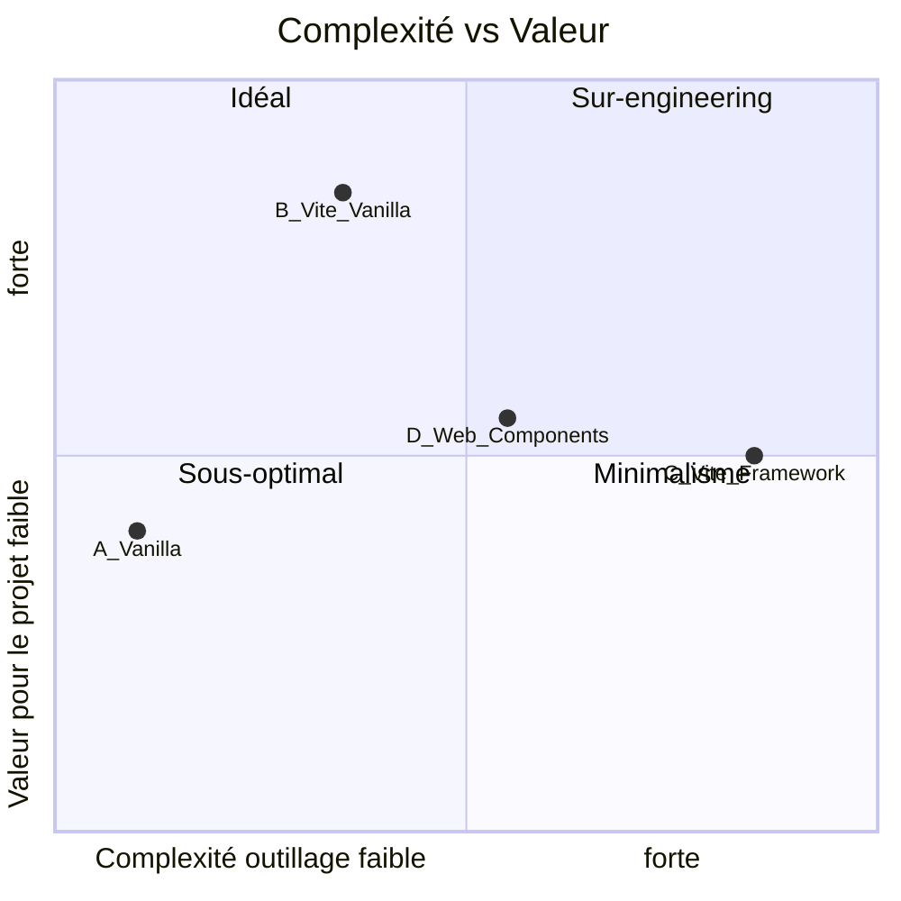
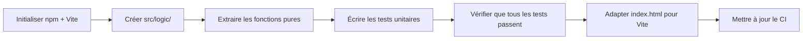

# Étude d'Architecture — AmorFati PWA

> Date : 2026-06-16  
> Auteur : Analyse technique  
> Statut : ✅ Implémenté — L'architecture proposée a été mise en œuvre (Vite + Vanilla JS, Option B). Voir `brief-handoff.md` pour l'état actuel.

---

## 1. Contexte et contraintes

### 1.1 Ce qu'est le projet

AmorFati est une **PWA légère** de suivi personnel :
- ~960 lignes HTML, ~800 lignes JS, ~420 lignes CSS
- Aucun backend, 100% client-side
- Données stockées en `localStorage`
- Déployée sur **GitHub Pages** (hébergement statique uniquement)
- Service Worker pour le offline
- Public cible : grand public francophone

### 1.2 Ce que le projet N'EST PAS

- Pas une SPA complexe avec routing côté client
- Pas une application avec des centaines de composants
- Pas un projet d'entreprise avec une équipe de 10 devs
- Pas une app qui nécessite un backend ou une API

### 1.3 Contraintes hard

| Contrainte | Détail |
|------------|--------|
| Hébergement | GitHub Pages — fichiers statiques uniquement, pas de serveur |
| PWA | Doit rester installable, fonctionner offline |
| Taille | L'app doit rester légère (< 100 KB payload idéal) |
| Simplicité | Un dev doit pouvoir comprendre le projet en < 30 min |
| Accessibilité | Doit fonctionner sans JS build si possible (ou avec un build minimal) |

---

## 2. Analyse des options architecturales

### 2.1 Option A — Vanilla JS + Node.js test runner (minimum viable)

```
AmorFati/
├── index.html          (HTML structurel uniquement)
├── app.js              (logique applicative, script classique)
├── logic.js            (fonctions pures exportées en ES module)
├── styles.css          (feuille de style)
├── service-worker.js
├── manifest.json
├── tests/
│   └── logic.test.mjs  (tests des fonctions pures)
├── package.json        (devDependencies: vitest)
└── icons/
```

**Comment ça marche :**
- `logic.js` est un ES module avec `export` pour les fonctions pures
- `app.js` est un script classique (pas `type="module"`) qui **duplique les références** aux constantes/fonctions de `logic.js` via une IIFE ou un simple import dynamique
- Les tests importent directement depuis `logic.js` via `import`
- Pas de build step pour la production

| Aspect | Évaluation |
|--------|-----------|
| Complexité outillage | ⭐ Très faible |
| Payload production | ⭐⭐⭐⭐⭐ Minimal (pas de bundler) |
| Testabilité | ⭐⭐⭐ Bonne (fonctions pures testables) |
| DX (Developer Experience) | ⭐⭐ Moyenne (pas de HMR, reload manuel) |
| Maintenabilité | ⭐⭐⭐ Bonne (séparation des préoccupations) |
| Risque | ⭐⭐⭐⭐⭐ Faible |

**Problème majeur :** `app.js` ne peut pas `import` depuis `logic.js` sans `type="module"`. Si on utilise `type="module"`, les fonctions globales ne sont plus accessibles aux `onclick` inline. Deux sous-options :

- **A1 : Dupliquer les constantes** dans `app.js` → réintroduit de la duplication
- **A2 : `type="module"` + `window.xxx =`** → expose les fonctions au scope global, fonctionne avec onclick

### 2.2 Option B — Vite + Vanilla JS (build léger)

```
AmorFati/
├── src/
│   ├── main.js          (point d'entrée, importe les modules)
│   ├── logic.js          (fonctions pures, ES modules)
│   ├── ui.js             (manipulation DOM, EventListeners)
│   ├── data/
│   │   ├── questions.js  (données des questions)
│   │   ├── interpretations.js
│   │   └── recommendations.js
│   └── style.css
├── public/
│   ├── icons/
│   ├── manifest.json
│   ├── offline.html
│   └── service-worker.js
├── index.html            (HTML minimal, point d'entrée)
├── tests/
│   ├── logic.test.js
│   └── ui.test.js
├── vite.config.js
├── package.json
└── README.md
```

**Comment ça marche :**
- Vite sert les fichiers en dev avec HMR
- En production, Vite bundle, minifie et tree-shake
- ES modules natifs en dev, bundle optimisé en prod
- Vitest pour les tests (intégration native avec Vite)
- Le SW est dans `public/` et n'est pas transformé par Vite

| Aspect | Évaluation |
|--------|-----------|
| Complexité outillage | ⭐⭐⭐ Moyenne (1 config file, 1 build step) |
| Payload production | ⭐⭐⭐⭐ Optimisé (minifié, tree-shaken) |
| Testabilité | ⭐⭐⭐⭐⭐ Excellente (Vitest + jsdom) |
| DX | ⭐⭐⭐⭐⭐ Excellente (HMR, source maps, auto-reload) |
| Maintenabilité | ⭐⭐⭐⭐ Bonne (modules séparés) |
| Risque | ⭐⭐⭐⭐ Faible (Vite est mature et très utilisé) |

**Avantages clés :**
- HMR instantané pendant le développement
- Bundle optimisé en production (minification, tree-shaking)
- Vitest intégré nativement — tests ultra-rapides
- Prêt pour TypeScript si le projet évolue
- Prêt pour i18n (imports dynamiques)

**Inconvénients :**
- Nécessite Node.js pour le dev et le build
- Un step de build avant déploiement (mais automatisable via CI)
- Ajoute ~200 lignes de config (vite.config.js, package.json)

### 2.3 Option C — Vite + Framework (React / Vue / Svelte)

```
AmorFati/
├── src/
│   ├── App.vue (ou App.jsx, App.svelte)
│   ├── components/
│   ├── views/
│   ├── stores/
│   └── ...
├── vite.config.js
├── package.json
└── ... (des dizaines de fichiers)
```

| Aspect | Évaluation |
|--------|-----------|
| Complexité outillage | ⭐⭐⭐⭐⭐ Élevée |
| Payload production | ⭐⭐⭐ Acceptable (framework runtime ~10-40 KB) |
| Testabilité | ⭐⭐⭐⭐⭐ Excellente |
| DX | ⭐⭐⭐⭐⭐ Excellente |
| Maintenabilité | ⭐⭐⭐⭐ Bonne (si on connaît le framework) |
| Risque | ⭐⭐ Moyen (over-engineering pour cette taille) |

**Pourquoi ce n'est PAS recommandé :**
- L'app fait 960 lignes de HTML et 800 de JS. Un framework ajouterait 10-40 KB de runtime pour... quoi ?
- La complexité cognitive augmente considérablement
- Le form de 10 questions est trivial en vanilla, verbeux en React/Vue
- Le state management (localStorage) est simple, pas besoin de Pinia/Redux
- Le routing est 4 onglets avec `display: none/block` — pas besoin de vue-router

**Verdict : ❌ Over-engineering. Rejeté.**

### 2.4 Option D — Web Components (Lit)

```
AmorFati/
├── src/
│   ├── main.js
│   ├── components/
│   │   ├── amor-fati-app.js
│   │   ├── assessment-form.js
│   │   ├── history-panel.js
│   │   └── settings-panel.js
│   └── logic.js
├── vite.config.js
├── package.json
└── ...
```

| Aspect | Évaluation |
|--------|-----------|
| Complexité outillage | ⭐⭐⭐⭐ Élevée |
| Payload production | ⭐⭐⭐⭐ Bon (~5 KB pour Lit) |
| Testabilité | ⭐⭐⭐⭐ Bonne |
| DX | ⭐⭐⭐⭐ Bonne |
| Maintenabilité | ⭐⭐⭐⭐ Bonne |
| Risque | ⭐⭐⭐ Moyen (courbe d'apprentissage) |

**Pourquoi ce n'est PAS recommandé actuellement :**
- Ajoute une dépendance (Lit) pour un gain marginal à cette échelle
- La réécriture en composants serait un gros travail pour un bénéfice limité
- Les Web Components natifs (sans Lit) sont trop verbeux
- À réviser si le projet grandit significativement

**Verdict : ⏸️ Prématuré. Gardé en réserve pour une évolution future.**

---

## 3. Comparatif décisionnel



| Critère | A (Vanilla) | B (Vite + Vanilla) | C (Framework) | D (Lit) |
|---------|:-----------:|:-----------------:|:------------:|:------:|
| Pas de build step | ✅ | ❌ | ❌ | ❌ |
| HMR / hot reload | ❌ | ✅ | ✅ | ✅ |
| Tests automatisés | ⚠️ | ✅ | ✅ | ✅ |
| Minification prod | ❌ | ✅ | ✅ | ✅ |
| Tree-shaking | ❌ | ✅ | ✅ | ✅ |
| Payload minimal | ✅✅ | ✅ | ⚠️ | ✅ |
| Courbe d'apprentissage | ✅✅ | ✅ | ❌ | ⚠️ |
| i18n futur | ❌ | ✅ | ✅ | ✅ |
| TypeScript futur | ❌ | ✅ | ✅ | ✅ |
| Déploiement simple | ✅✅ | ⚠️ (build step) | ⚠️ | ⚠️ |
| Adapté à la taille du projet | ✅✅ | ✅ | ❌ | ⚠️ |

---

## 4. Recommandation : Option B — Vite + Vanilla JS

### 4.1 Pourquoi Vite + Vanilla JS

**Pas Node.js « pour le fun »** — Node.js n'est pas un runtime de l'application. C'est un **outil de développement et de build**. L'application reste 100% côté client. Node.js n'est nécessaire que sur le poste du développeur et dans la CI.

On choisit Vite + Vanilla JS parce que :

1. **Le projet a atteint un point où la séparation des préoccupations est nécessaire** — les données métier (questions, interprétations), la logique (scoring, validation) et l'UI doivent être dans des fichiers séparés. Vite rend cette séparation naturelle via ES modules.

2. **Les tests automatisés sont indispensables** — comme l'a souligné l'analyse, la logique de scoring, les interprétations et la validation d'import sont des candidats idéaux pour les tests unitaires. Vitest fonctionne nativement avec Vite.

3. **La DX (Developer Experience) est transformante** — HMR instantané, source maps, erreurs claires, reload automatique. On passe de 30 secondes de reload à du quasi-instantané.

4. **L'optimisation de production est automatique** — minification, tree-shaking, code splitting si nécessaire. Le service worker et les assets sont gérés proprement.

5. **La porte est ouverte pour l'évolution** — si le projet grandit, Vite supporte nativement TypeScript, i18n, et les Web Components. Pas besoin de tout refaire.

### 4.2 Pourquoi PAS Node.js en production

**Node.js n'est utilisé qu'en développement et en CI.** L'application compilée est un ensemble de fichiers statiques (HTML, CSS, JS minifié) déployés sur GitHub Pages. Aucun serveur Node.js en production.

```
┌─────────────────┐     ┌──────────────┐     ┌─────────────────┐
│   Développement  │     │     CI       │     │   Production    │
│                  │     │  GitHub      │     │  GitHub Pages   │
│  npm install     │────▶│  Actions     │────▶│                 │
│  npm run dev     │     │  npm run    │     │  Fichiers       │
│  npm run test    │     │  build      │     │  statiques      │
│                  │     │  + test     │     │  (HTML/CSS/JS)  │
└─────────────────┘     └──────────────┘     └─────────────────┘
       Node.js               Node.js            Pas de Node.js
```

### 4.3 Structure de fichiers proposée

```
AmorFati/
├── src/
│   ├── main.js                 # Point d'entrée — init, event listeners, SW registration
│   ├── logic/
│   │   ├── scoring.js          # calculateResults(), getInterpretation(), DIMENSIONS
│   │   ├── recommendations.js   # PRIORITY_RECOMMENDATIONS, getRecommendations()
│   │   ├── storage.js           # saveData(), loadData(), importData(), exportData()
│   │   └── constants.js         # PRIORITY_LABELS, STORAGE_KEY, etc.
│   ├── ui/
│   │   ├── tabs.js             # switchTab(), navigation
│   │   ├── assessment.js       # startAssessment(), calculateResults(), displayResults()
│   │   ├── history.js           # displayHistory(), createChart(), viewAssessmentDetails()
│   │   ├── settings.js          # displaySettings(), changePriority()
│   │   └── modal.js             # Remplace alert/confirm/prompt (T1.1)
│   ├── data/
│   │   ├── questions.js         # Données des 10 questions
│   │   └── interpretations.js    # Les 5 niveaux d'interprétation
│   └── style.css                # Styles (déplacé à la racine en prod)
├── public/
│   ├── icons/                   # Icônes PWA
│   ├── manifest.json            # Manifeste PWA
│   ├── offline.html             # Page hors-ligne
│   └── service-worker.js        # Service Worker
├── tests/
│   ├── scoring.test.js          # Tests de la logique de scoring
│   ├── recommendations.test.js  # Tests des recommandations
│   ├── storage.test.js           # Tests du stockage (avec mock localStorage)
│   ├── interpretations.test.js  # Tests des interprétations
│   ├── escapeHtml.test.js        # Tests de sanitisation XSS
│   └── setup.js                  # Setup jsdom pour les tests
├── index.html                   # HTML minimal (point d'entrée Vite)
├── vite.config.js               # Configuration Vite
├── vitest.config.js             # Configuration Vitest (peut être dans vite.config.js)
├── package.json                  # Dependencies et scripts
├── .gitignore                    # node_modules, dist, etc.
├── .editorconfig                 # Convention de formatage
├── Doc/                          # Documentation (déjà existant)
├── scripts/
│   └── smoke_test.py             # Smoke test existant (gardé)
└── .github/
    └── workflows/
        ├── deploy-pages.yml       # Mise à jour pour inclure le build
        ├── lighthouse.yml
        └── static.yml             # À supprimer (redondant)
```

### 4.4 Configuration Vite proposée

```js
// vite.config.js
import { defineConfig } from 'vite';

export default defineConfig({
  root: '.',                     // index.html à la racine
  build: {
    outDir: 'dist',              // Dossier de sortie
    rollupOptions: {
      input: {
        main: 'index.html',
      },
    },
  },
});
```

### 4.5 Configuration Vitest proposée

```js
// vitest.config.js
import { defineConfig } from 'vitest/config';

export default defineConfig({
  test: {
    environment: 'jsdom',       // Simule le DOM pour les tests UI
    globals: true,                // describe/it/expect globaux
    setupFiles: './tests/setup.js',
  },
});
```

### 4.6 Scripts package.json

```json
{
  "name": "amorfati",
  "version": "2.0.0",
  "private": true,
  "type": "module",
  "scripts": {
    "dev": "vite",
    "build": "vite build",
    "preview": "vite preview",
    "test": "vitest run",
    "test:watch": "vitest",
    "test:coverage": "vitest run --coverage"
  },
  "devDependencies": {
    "vitest": "^3.0.0",
    "jsdom": "^26.0.0"
  }
}
```

### 4.7 Impact sur le déploiement GitHub Pages

Le workflow CI doit être mis à jour pour inclure un step de build :

```yaml
# .github/workflows/deploy-pages.yml (mis à jour)
- name: Build
  run: npm ci && npm run build

- name: Upload artifact
  uses: actions/upload-pages-artifact@v3
  with:
    path: dist
```

Le dossier `dist/` (généré par Vite) sera déployé au lieu du dossier racine.

### 4.8 Impact sur le Service Worker

Le `service-worker.js` doit être dans `public/` pour ne pas être transformé par Vite. Le `PRECACHE_ASSETS` doit lister les fichiers générés par le build :

```js
// public/service-worker.js
const CACHE_NAME = 'amor-fati-cache-v3';
const PRECACHE_ASSETS = [
  './',
  'index.html',
  'manifest.json',
  'icons/icon-192.png',
  'icons/icon-512.png',
  'icons/icon-180.png',
  'offline.html',
  // Les assets JS/CSS seront ajoutés dynamiquement
  // ou via un plugin Vite (vite-plugin-pwa)
];
```

> **Note :** À terme, on pourrait utiliser `vite-plugin-pwa` pour générer automatiquement le manifest et le SW avec la liste des assets. Pour l'instant, on garde le SW manuel.

---

## 5. Stratégie de test (TDD)

### 5.1 Principe

Le TDD (Test-Driven Development) sera appliqué de manière **pragmatique** :
- Les fonctions pures (logique métier) sont testées en priorité
- Les fonctions UI (DOM) sont testées avec jsdom
- Les tests E2E sont un objectif futur (Playwright), pas une priorité immédiate

### 5.2 Pyramide de tests proposée

```
           ╱╲
          ╱  ╲        E2E (Playwright) — futur
         ╱    ╲       2-3 scénarios critiques
        ╱──────╲
       ╱        ╲     Intégration UI (jsdom)
      ╱  5-8 tests  ╲  Tabs, form, export
     ╱────────────────╲
    ╱                  ╲  Unitaire (Vitest pur)
   ╱   15-20 tests      ╲  scoring, validation, XSS
  ╱──────────────────────╲
```

### 5.3 Modules testables en priorité

| Module | Fonctions | Priorité | Raison |
|--------|-----------|----------|--------|
| `scoring.js` | `calculateResults`, `getInterpretation` | 🔴 P0 | Logique métier critique, facile à tester |
| `recommendations.js` | `getRecommendations` | 🔴 P0 | Logique métier, dépend de conditions multiples |
| `storage.js` | `loadData`, `saveData`, `importData`, `exportData` | 🟠 P1 | Validation des données, edge cases |
| `constants.js` | `escapeHtml` | 🟠 P1 | Sécurité XSS |
| `tabs.js` | `switchTab` | 🟡 P2 | UI, testable avec jsdom |
| `assessment.js` | `startAssessment` | 🟡 P2 | UI + logique mixte |

### 5.4 Exemple de test TDD

```js
// tests/scoring.test.js
import { describe, it, expect } from 'vitest';
import { getInterpretation, calculateResults } from '../src/logic/scoring.js';

describe('getInterpretation', () => {
  it('returns nihilism level for score 0', () => {
    const result = getInterpretation(0);
    expect(result.title).toContain('Nihilisme');
    expect(result.min).toBe(0);
    expect(result.max).toBe(8);
  });

  it('returns accomplished level for score 40', () => {
    const result = getInterpretation(40);
    expect(result.title).toContain('Accompli');
    expect(result.min).toBe(33);
    expect(result.max).toBe(40);
  });

  it('returns resignation for score 12', () => {
    const result = getInterpretation(12);
    expect(result.title).toContain('Résignation');
  });

  it('returns acceptance for score 20', () => {
    const result = getInterpretation(20);
    expect(result.title).toContain('Acceptation');
  });

  it('returns affirmation for score 28', () => {
    const result = getInterpretation(28);
    expect(result.title).toContain('Affirmation');
  });
});

describe('escapeHtml', () => {
  it('escapes HTML special characters', () => {
    expect(escapeHtml('<script>alert("xss")</script>'))
      .toBe('&lt;script&gt;alert(&quot;xss&quot;)&lt;/script&gt;');
  });

  it('escapes ampersands', () => {
    expect(escapeHtml('Passé & Ressentiment'))
      .toBe('Passé &amp; Ressentiment');
  });

  it('returns empty string for non-string input', () => {
    expect(escapeHtml(null)).toBe('');
    expect(escapeHtml(undefined)).toBe('');
  });
});
```

---

## 6. Plan de migration (phases)

### Phase 1 — Fondations (1-2 jours)



- `npm init` + installer `vitest`, `jsdom`
- Créer `src/logic/scoring.js`, `src/logic/constants.js`, etc.
- Écrire les tests pour les fonctions pures
- Configurer Vite pour le build
- Adapter le workflow GitHub Actions

### Phase 2 — Refactoring UI (2-3 jours)

- Déplacer les event listeners du HTML vers `src/main.js`
- Supprimer les `onclick` inline (T1.9)
- Créer `src/ui/` avec les modules de manipulation DOM
- Ajouter les tests d'intégration UI

### Phase 3 — Améliorations P1 (3-5 jours)

- Remplacer `alert/confirm/prompt` par des composants modaux
- Ajouter les attributs ARIA
- Corriger le contraste
- Nettoyer le CSS (variables, inline styles)

### Phase 4 — Améliorations P2 (itératif)

- Dark mode
- i18n
- E2E tests (Playwright)
- Optimisation icônes (WebP)

---

## 7. Risques et mitigation

| Risque | Probabilité | Impact | Mitigation |
|--------|------------|--------|------------|
| Sur-complexifier l'outil pour la taille du projet | Moyen | Moyen | Garder la structure plate (pas de sur-découpage en sous-dossiers), limiter les dépendances |
| Node.js pas disponible sur le poste du dev | Faible | Élevé | Documenter l'installation, ajouter un `.nvmrc` |
| Build Vite qui casse le SW | Faible | Élevé | Tester le SW en local après chaque build, utiliser `public/` pour les fichiers statiques |
| Régression de l'existant pendant la migration | Moyen | Élevé | Écrire les tests AVANT de migrer, smoke test en CI |
| Perte de la compatibilité navigateur | Faible | Moyen | Vite génère du JS compatible par défaut, configurer les targets si nécessaire |

---

## 8. Questions ouvertes

1. **TypeScript ?** — Pas immédiatement, mais la porte est ouverte. Vite le supporte nativement. On pourrait ajouter des `.ts` progressivement (d'abord `logic/`, puis `ui/`).

2. **vite-plugin-pwa ?** — Plugin Vite qui génère automatiquement le manifest et le SW avec workbox. Utile mais ajoute une dépendance. À évaluer en Phase 3.

3. **Linting ?** — ESLint + Prettier devront être ajoutés en Phase 1 (avant même les tests). C'est un prérequis pour la qualité du code.

4. **Faut-il garder le smoke test Python ?** — Oui, il vérifie la présence des fichiers statiques. Il complémente les tests Vitest qui testent la logique.

---

## 9. Décision

**Recommandation : Option B — Vite + Vanilla JS**

- ✅ Adaptée à la taille du projet
- ✅ Offre TDD, HMR, minification, tree-shaking
- ✅ Node.js uniquement en dev/CI, pas en production
- ✅ Évolutif (TypeScript, i18n, PWA plugin)
- ✅ Pas d'over-engineering

**Prochaine étape :** Valider cette architecture, puis lancer la Phase 1 (initialiser le projet Vite + extraire les fonctions pures + écrire les tests).